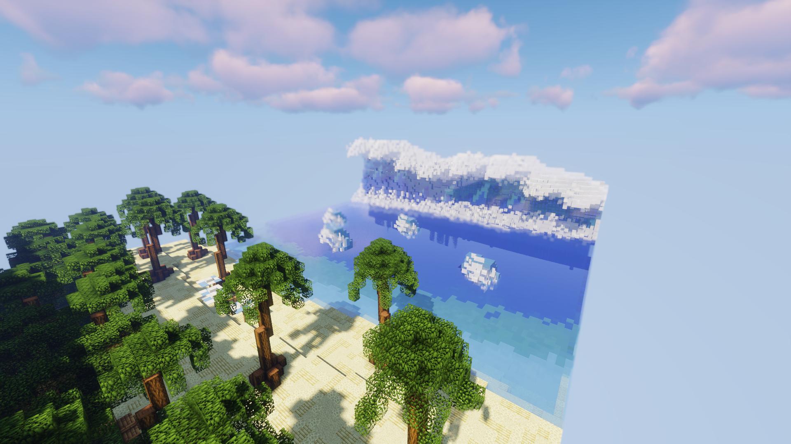

# ⛱ Horizons Mystérieux


Cette extension de territoire est utilisable par [<mark style="color:red;">Dagon</mark>](../roles/fleaux/dagon.md), ou par [<mark style="color:purple;">Okkotsu Yuta</mark>](../roles/yuta-and-rika/okkotsu-yuta.md) s'il vient à la copier.


* L'extension de territoire est caractérisée par sa <mark style="color:yellow;">petite taille</mark>. Des murs <mark style="color:purple;">invisibles</mark> se trouvent sur les deux longueurs de l'extension, et une <mark style="color:green;">montagne</mark> et une <mark style="color:blue;">vague</mark> pour les deux largeurs.
* Il n'est pas possible de gravir la <mark style="color:green;">montagne</mark> ou la grosse <mark style="color:blue;">vague</mark>, et des blocs <mark style="color:purple;">invisibles</mark> se trouvent en dessous des <mark style="color:blue;">petites vagues</mark> pour combler le sol.
* Les joueurs apparaissent au niveau de la <mark style="color:yellow;">plage</mark>, sur les <mark style="color:red;">transats</mark>.


Si vous possédez l'extension de territoire <mark style="color:yellow;">Horizons Mysterieux</mark> vous pourrez contre extension à partir de <mark style="color:yellow;">30 secondes</mark> dans celle-ci. Il suffit de cliquer sur l'activable de l'extension pour être téleporter dans votre extension avec les autres joueurs present.t.


