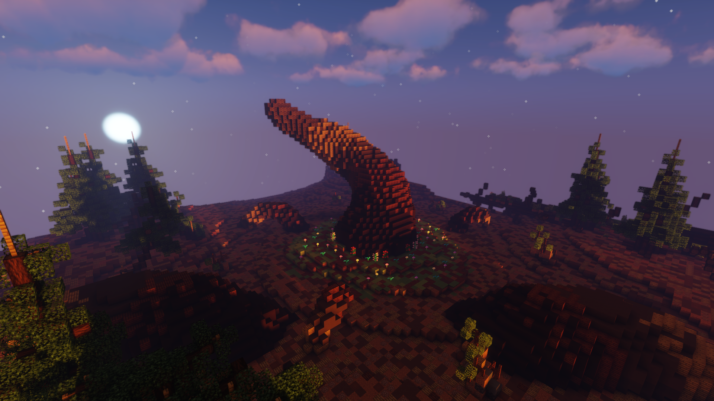

# 🌳 Sylve Lugubre


Cette extension de territoire est utilisable par [<mark style="color:red;">Hanami</mark>](../roles/fleaux/hanami.md), ou par [<mark style="color:purple;">Okkotsu Yuta</mark>](../roles/yuta-and-rika/okkotsu-yuta.md) s'il vient à la copier.


* L'extension de territoire est caractérisée par la présence d'une <mark style="color:green;">énorme branche</mark> au centre de celle-ci. Il est possible de la gravir et de se rendre au <mark style="color:purple;">point culminant</mark>.
* Malgré les <mark style="color:green;">arbres</mark> autour de l'extension, il est très facile de se déplacer dedans, laissant place à des combats potentiellement <mark style="color:red;">long</mark>.
* Les joueurs apparaissent dans l'extension <mark style="color:yellow;">autour</mark> de la <mark style="color:green;">branche centrale</mark>.


Si vous possédez l'extension de territoire <mark style="color:yellow;">Sylve Lugubre</mark> vous pourrez contre extension à partir de <mark style="color:yellow;">35 secondes</mark> dans celle-ci. Il suffit de cliquer sur l'activable de l'extension pour être téleporter dans votre extension avec les autres joueurs present.


