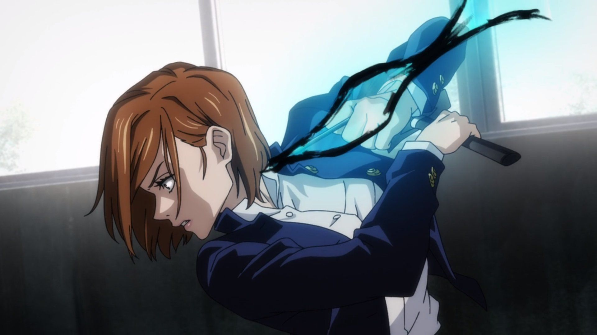

# 🧶 Nobara Kugisaki

> <mark style="color:green;">**Nobara Kugisaki**</mark> est une élève de seconde année à l'école d'exorcisme de Tokyo. Elle possède 11 cœurs permanents.&#x20;


A l’annonce des rôles, <mark style="color:green;">Nobara</mark> reçoit un Arc Puissance 2 ainsi que 32 flèches.&#x20;

Chaque fois que <mark style="color:green;">Nobara</mark> touche un joueur avec ce dernier, elle reçoit un message dans le chat lui proposant de planter un clou dans le joueur.&#x20;


Si jamais elle le fait cela lui consomme <mark style="color:purple;">50 d’énergies occultes</mark> <mark style="color:yellow;">toutes les 30 secondes.</mark>\



Elle aura donc <mark style="color:yellow;">une flèche</mark> au-dessus de sa hotbar lui permettant de <mark style="color:yellow;">traquer le joueur</mark> avec le nombre de blocs qui la sépare de ce dernier.&#x20;

Elle peut <mark style="color:yellow;">maximum planter 3 clous</mark> en même temps.&#x20;

* Si jamais <mark style="color:green;">Nobara</mark> continue à traquer des joueurs alors qu’elle n’a plus assez d’énergie occulte, elle <mark style="color:yellow;">perdra 2 cœurs par clous toutes les 30 secondes.</mark>&#x20;
*   Si jamais un joueur qui se fait traquer s’éloigne de plus de 150 blocs de <mark style="color:green;">Nobara</mark>, le clou se retire et <mark style="color:yellow;">enlève 2 cœurs permanents pendant 5 minutes aux joueurs.</mark>

    
    <mark style="color:green;">Nobara</mark> possède la commande **/jujutsu clou** qui lui permet d'ouvrir une interface lui permettant de retirer ses clous.\

    



Elle reçoit un items nommé "<mark style="color:blue;">Résonance</mark>" :

Avec <mark style="color:red;">Clic droit</mark> elle peut <mark style="color:yellow;">lier sa vie à celle du joueur ciblé</mark> pendant 10 secondes. Le joueur et elle possèdent une <mark style="color:yellow;">barre de 20 cœurs commune</mark>. Elle correspond à l'addition de leur 2 barres de vie de base.

&#x20;Le joueur ciblé ne peut pas mourir des dégâts que <mark style="color:green;">Nobara</mark> subit, de même à l'inverse, si ce dernier subit des dégâts elle en subit aussi mais ne peut pas en mourir.&#x20;


Celui lui coûte <mark style="color:purple;">500 énergies occultes</mark> et n'est utilisable <mark style="color:yellow;">que 3fois.</mark> \




A chaque début de nuit elle reçoit un message qui lui <mark style="color:yellow;">propose de sacrifier 1 cœur</mark> permanent en échange de <mark style="color:yellow;">savoir s’il y a des fléaux ou non proche d'elle</mark> (rayon de 30 blocs).&#x20;

Si [<mark style="color:green;">Itadori Yuji</mark>](itadori-yuji.md) meurt, elle obtient l’identité de [<mark style="color:green;">Fushiguro Megumi</mark>](megumi-fushiguro.md) et inversement sauf si [<mark style="color:green;">Itadori</mark>](itadori-yuji.md) possède un pacte.

