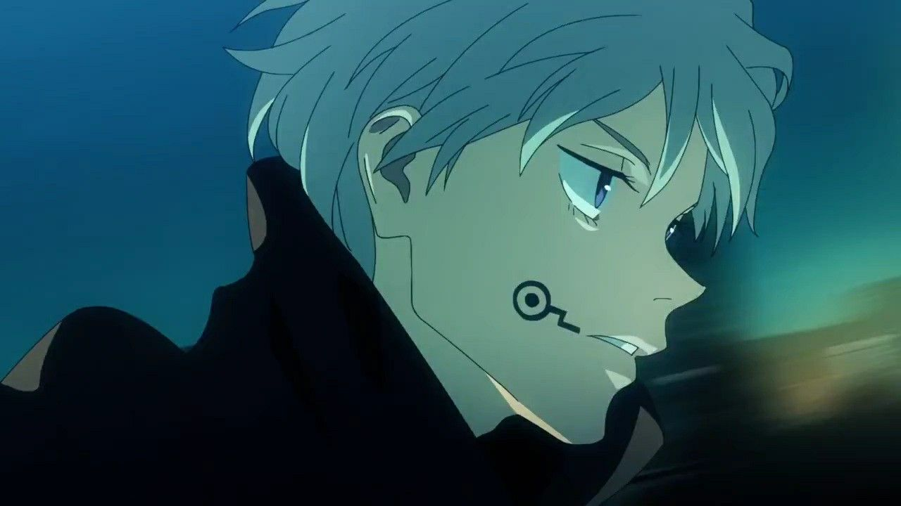

# ⚡ Toge Inumaki

> <mark style="color:green;">**Toge Inumaki**</mark> est un élève de première année à l'école d'exorcisme de Tokyo. Possédant des facilités à se déplacer, il possède l'effet <mark style="color:blue;">Speed 1</mark> permanent.


Il possède un item lui permettant d'utiliser <mark style="color:red;">**3 pouvoirs différents**</mark>** utilisables** avec un clic gauche, il peut choisir lequel  utiliser avec un clic droit [_(voir explication)_](../../specifites/objets-de-pouvoir.md)_:_\
\
&#x20;**→** <mark style="color:orange;">Ordre</mark> <mark style="color:orange;"></mark><mark style="color:orange;">**Ne bouge plus**</mark>:\
<mark style="color:yellow;">Immobilise le joueur</mark> visé pendant **2 secondes**. Malgré l'immobilisation, le joueur ne sera pas bloqué et pourra toujours asséner des coups.\
Nécessite [<mark style="color:purple;">**200 énergies occultes**</mark>](../../specifites/energie-occulte.md), possède un temps de rechargement de **15 minutes**.\
\
&#x20;**→** <mark style="color:orange;">Ordre</mark> <mark style="color:orange;"></mark><mark style="color:orange;">**Explosion**</mark>:\
Déclenche une explosion à la position du joueur visé. Celle-ci <mark style="color:yellow;">inflige</mark> <mark style="color:yellow;">**3 cœurs**</mark> de dégâts et <mark style="color:yellow;">repousse le joueur</mark> en arrière sur **10 blocs**. Le pouvoir ne peut pas tuer (_si le joueur possède moins de 3 cœurs, il restera à un demi cœur_). En contrepartie <mark style="color:green;">Toge</mark> obtiendra <mark style="color:orange;">Weakness</mark> pendant 30 secondes\
Nécessite [<mark style="color:purple;">**300 énergies occultes**</mark>](../../specifites/energie-occulte.md), possède un temps de rechargement de **20 minutes**.\
\
&#x20;**→** <mark style="color:orange;">Ordre</mark> <mark style="color:orange;"></mark><mark style="color:orange;">**Dors**</mark>:\
Applique l'<mark style="color:yellow;">effet de potion</mark> <mark style="color:orange;">**Blindness**</mark> au joueur visé pendant **7 secondes**. La vitesse du joueur est légèrement augmentée pendant toute la durée pour simuler un sprint qui n'est normalement pas possible avec l'effet.\
Nécessite [<mark style="color:purple;">**100 énergies occultes**</mark>](../../specifites/energie-occulte.md), possède un temps de rechargement de **15 minutes**.\



