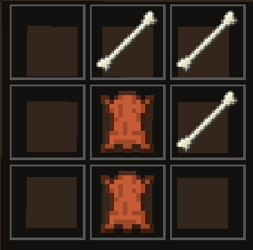
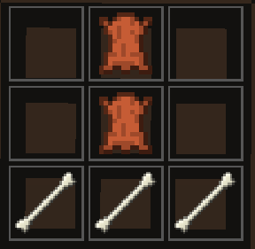
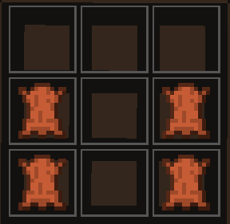
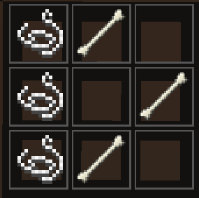
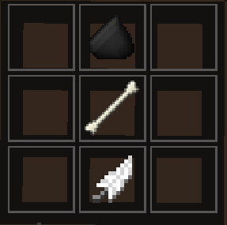

# 🪓 Juzo

Il connait l'identité de [<mark style="color:red;">Uraume</mark>](uraume.md) ainsi que celle d'un [<mark style="color:red;">Fléau de Classe S</mark>](fleau-de-classe-s.md) aléatoire. De plus, lorsqu'il tue un personnage féminin, il obtient <mark style="color:yellow;">un cœur supplémentaire.</mark>


<mark style="color:red;">Juzo</mark> obtient une hache en fer a l'annonce des rôles qu'il peut lancer dans n'importe quelle direction.&#x20;

Si la hache touche un joueur il <mark style="color:yellow;">perdra 2 cœurs</mark>.

<mark style="color:red;">Juzo</mark> peut se rendre là où la hache atterrit pour la récupérer et avoir 10s de cooldown ou il peut attendre 2min afin de la récupérer automatiquement



Il possède la capacité '<mark style="color:blue;">Voile</mark>' :&#x20;

Cette dernière pose un beacon en faisant clic-droit et créer une zone d'un rayon de 50 blocs. Le voile empêche les joueurs à l'intérieur d'en sortir. Cependant n'importe qui peut y rentrer.


[<mark style="color:green;">Satoru Gojo</mark>](broken-reference) ne peut pas rentrer ou se situer dans la zone du "<mark style="color:blue;">Voile</mark>".

Seul <mark style="color:red;">Juzo</mark> peut en sortir.

Cette capacité lui coûte <mark style="color:purple;">500 énergies occultes</mark>.


Si ce dernier meurt, le voile disparait et il peut l'annuler à tout moment en cliquant de nouveau sur le beacon.



Enfin, il a la possibilité de <mark style="color:yellow;">crafter plusieurs items</mark> grâce à un système d'ossement. Afin de les récupérer il lui suffit de <mark style="color:yellow;">participer à l'élimination d'un exorciste</mark> et d'effectuer la commande **/jujutsu bank.**&#x20;


* Liste du système d'ossement (os et Cuir récupérés par rôle) :&#x20;

|       Rôle       | Nombre d'Os | Nombre de Cuir |
| :--------------: | :---------: | :------------: |
|    Satoru Gojo   |      5      |        5       |
|     Aoi Todo     |      4      |        4       |
|  Masamichi Yaga  |      4      |        4       |
|   Kento Nanami   |      3      |        3       |
|      Mei Mei     |      3      |        3       |
|   Itadori Yuji   |      3      |        3       |
| Megumi Fushiguro |      3      |        3       |
|  Noritoshi Kamo  |      3      |        3       |
|   Utahime Iori   |      2      |        2       |
|    Maki Zenin    |      2      |        2       |
|  Nobara Kugisaki |      2      |        2       |
|     Mai Zenin    |      2      |        2       |
|    Kasumi Miwa   |      2      |        2       |
|   Inumaki Toge   |      1      |        1       |
|  Momo Nishimiya  |      1      |        1       |
|  hamaru Ultimate |      1      |        1       |

* Schémas des craft possibles :&#x20;

<mark style="color:blue;">Hache Osseuse</mark>, qui confère 10% de <mark style="color:red;">Force</mark> avec un <mark style="color:red;">clic-droit</mark>.

Le <mark style="color:blue;">Porte Manteaux</mark> permet au joueur de donner des items osseux.&#x20;

Le <mark style="color:blue;">Tablier</mark> qui confère 10% de <mark style="color:green;">Résistance</mark> avec un <mark style="color:red;">clic-droit</mark>.

La Sandale qui confère 10% de <mark style="color:blue;">Vitesse</mark> avec un <mark style="color:red;">clic-droit.</mark>

<mark style="color:blue;">L'Arc Osseux</mark> qui est puissance II et recharge ses flèches 30% plus vite.

Et enfin, la <mark style="color:blue;">Flèche Osseuse</mark> qui <mark style="color:yellow;">inflige 1 cœur</mark> de plus qu'un flèche normale. (Elles sont à utilisation unique)&#x20;

.png)
