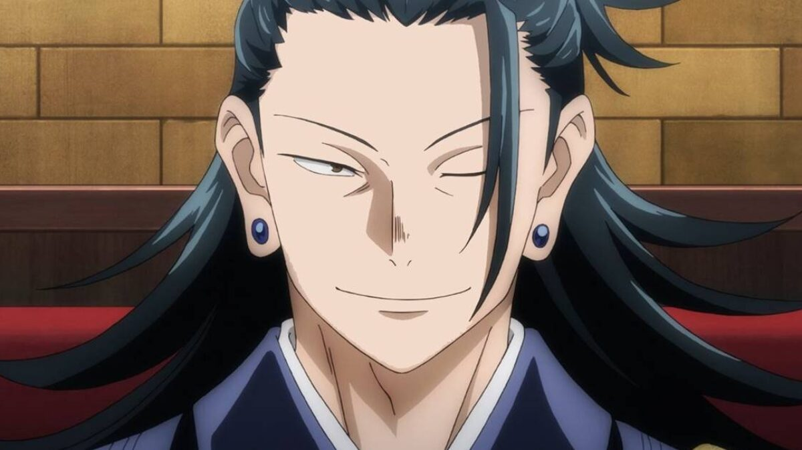

# 👺 Suguru Geto

<mark style="color:red;">Suguru</mark> est un ancien étudiant de l'école d'exorcisme de Tokyo . Il possède l'effet <mark style="color:blue;">**Speed 1**</mark> en permanence et obtient l'effet <mark style="color:red;">**Force 1**</mark> si aucun autre Fléau ne se trouve à côté de lui dans un rayon de 5 blocs.&#x20;


Étant un expert en art martiaux, si il réussit à effectuer un combo de 3 coups sur un joueur, ce dernier obtiendra <mark style="color:orange;">Nausée</mark> pendant 10 secondes. (cooldown de 45 secondes)


* Il possède la commande **/jjk orbe** qui lui permet d'<mark style="color:yellow;">accéder à un inventaire</mark> où sont stockées les orbes noires des fléaux qui meurent proches de lui.&#x20;

&#x20;     <mark style="color:yellow;">Quand un fléaux meurt</mark> à moins de 30 blocs de lui, <mark style="color:yellow;">il obtient une Orbe Noire</mark> plus ou moins

&#x20;      puissante selon le fléaux.


Les effets des orbes ne restent qu’<mark style="color:yellow;">un seul épisode</mark>. Chaque utilisation d’orbe consomme <mark style="color:purple;">200 d’énergie occulte.</mark>


Voici la liste des effets de L'Orbe Noire obtenue selon le fléaux qui meurt :&#x20;

|                                    Fléaux                                   |                                                                    Effet de l'Orbe Noire                                                                   |
| :-------------------------------------------------------------------------: | :--------------------------------------------------------------------------------------------------------------------------------------------------------: |
|               [<mark style="color:red;">Jogo</mark>](jogo.md)               | Il obtient un activable qui lui permet <mark style="color:yellow;">d'activer / désactiver</mark> un effet de <mark style="color:blue;">Fire Aspect.</mark> |
|             [<mark style="color:red;">Hanami</mark>](hanami.md)             |                  Tous les 6 coups d’épée il <mark style="color:yellow;">retire 15% de l’énergie occulte restante</mark> du joueur frappé.                  |
|             [<mark style="color:red;">Mahito</mark>](mahito.md)             |                                              Il gagne l’effet <mark style="color:green;">Résistance 1.</mark>                                              |
|              [<mark style="color:red;">Dagon</mark>](dagon.md)              |                   Ses bottes gagnent l’enchantement <mark style="color:blue;">Agility</mark> <mark style="color:blue;">Aquatique 2</mark>                  |
|  [<mark style="color:red;">Fléaux de Classe S</mark>](fleau-de-classe-s.md) |                                             Il gagne <mark style="color:yellow;">2 cœurs supplémentaires</mark>                                            |
| [<mark style="color:purple;">Rika</mark>](../yuta-and-rika/rika-orimoto.md) |                                    Sa <mark style="color:yellow;">récupération d'énergie occulte augmente de 50%.</mark>                                   |
|     [<mark style="color:orange;">Sukuna</mark>](../solitaires/sukuna.md)    |     Il débloque l’Extension du territoires : [<mark style="color:orange;">Autel Démoniaque.</mark>](../../extensions-de-territoire/autel-demoniaque.md)    |

* &#x20;Il possède aussi la commande **/jjk mort** qui lui permet de <mark style="color:yellow;">simuler sa mort</mark>. Cette commande enverra un message <mark style="color:yellow;">d’annonce de mort</mark> avec son pseudonyme et il <mark style="color:yellow;">n'apparaîtra plus dans la liste des joueurs</mark>. (1 seule fois dans la partie).


Enfin, il possède un item lui permettant d'activer <mark style="color:blue;">Lisère du Supplice.</mark>&#x20;

<mark style="color:red;">Clique droit pendant 5 secondes</mark> sur l'item donne accès à un menu qui lui permet de choisir un joueur dans un rayon de 30 blocs. Le joueur choisi sera <mark style="color:yellow;">scellé pendant 5 minutes</mark> pour tous les joueurs sauf [<mark style="color:green;">Gojo</mark>](../exorcistes/satoru-gojo.md) 3 minutes. (1 seule fois dans la partie).


* Utilisation Unique
* &#x20;Cela lui coûte <mark style="color:purple;">1,000 énergie Occulte</mark> et est <mark style="color:red;">utilisable uniquement après 1h30 de jeux.</mark>



