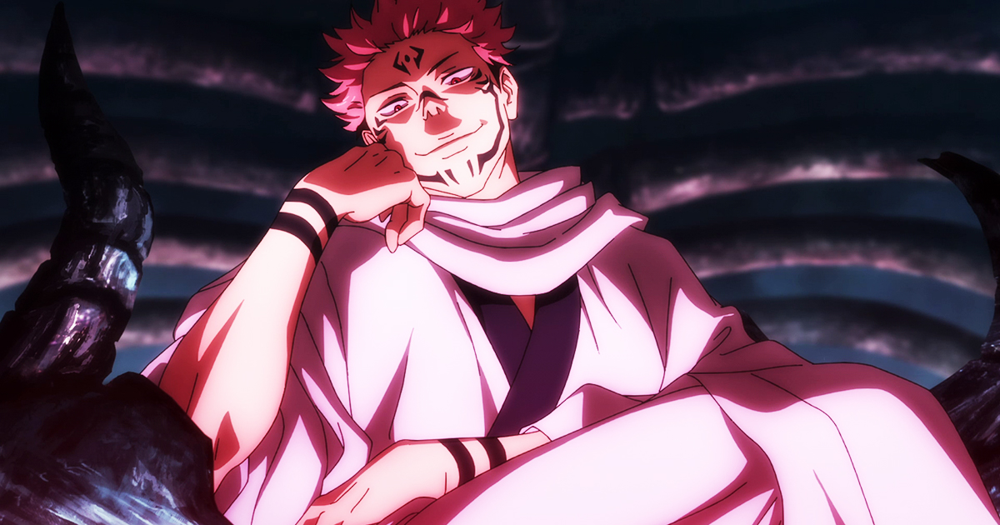

# 💥 Sukuna


Il possède l'effet <mark style="color:red;">Force I</mark> la nuit et l'effet <mark style="color:green;">Résistance I</mark> de manière permanente.

Il régénère son énergie occulte 25% plus vite que les autres et possède une flèche au dessus de sa hotbar lui indiquant le joueur le plus proche ayant un de ses doigts.&#x20;



* Chaque doigt qu'il récupère lui donne 1 cœur permanent supplémentaire excepté le numéro 3, 5 et 7 qui lui confèrent Speed 1, Force 1 et faiblesse aux fléaux proches de lui.&#x20;
* Il obtient régénération 2 pendant 10 secondes ainsi que <mark style="color:purple;">100 énergies</mark> <mark style="color:purple;">occultes</mark> à chaque doigt récupéré.&#x20;


Pour récupérer un doigt il faut tuer son porteur ou passer à moins de 3 blocs de l'un d'entre eux.




Il possède un item nommé **"**<mark style="color:blue;">Sorts Innés</mark>**".**

Ce dernier n'est obtenable qu'à **une condition :**

Il doit posséder au minimum un doigt.&#x20;

**→** Le <mark style="color:red;">**clic-gauche**</mark> lui permet d'échanger l'item que tient son adversaire par un autre qui sera choisit au hasard dans l'inventaire.


Cette capacité coûte <mark style="color:purple;">200 énergies occultes</mark> et à un cooldown de 3 minutes.


**→** Le <mark style="color:red;">**clic-droit**</mark> lui permet d'effectuer un double saut.


Cette capacité coûte <mark style="color:purple;">100 d'énergie occulte.</mark>




Il possède une  "<mark style="color:purple;">Extension de Territoire : Hôtel Démoniaque</mark>".

Cela lui permet de téléporter les joueurs à moins de **10 blocs** de lui dans son extension et il perdront la moitié de leur vie.

Le **PvP est activé**.


Dans son extension, <mark style="color:orange;">Sukuna</mark> garde ses effets mais ne peut plus utiliser ses activables.inutes.&#x20;



Si jamais [<mark style="color:green;">Itadori</mark>](../exorcistes/itadori-yuji.md) vient à lui proposer un pacte, il peut choisir de l'accepter et en choisir la nature ou de le refuser et le tuer.

* **Pacte de Corruption** :&#x20;

<mark style="color:orange;">Sukuna</mark> obtient l'identité de [<mark style="color:green;">Itadori</mark>](../exorcistes/itadori-yuji.md) et ils doivent gagne ensemble en échange de 2 cœurs permanents. &#x20;

Si Itadori vient à récupérer un doigt, c'est en réalité <mark style="color:orange;">Sukuna</mark> qui le recevra à sa place.&#x20;

Enfin, [<mark style="color:green;">Itadori</mark>](../exorcistes/itadori-yuji.md) gagne 1 demi-coeur ainsi que 10% de régénération pour chaque doigt en la possession de Sukuna.&#x20;

* **Pacte de Non Agression :**&#x20;

<mark style="color:orange;">Sukuna</mark> obtient l'identité de [<mark style="color:green;">Itadori</mark>](../exorcistes/itadori-yuji.md) et il reçoit un item qui lui permet d'activer ou désactiver le PVP entre eux.&#x20;

Il peut aussi utiliser la commande **/jjk yuji** qui lui permet d'obtenir <mark style="color:yellow;">l'identité et le rôle de tous les joueurs</mark> se trouvant dans un rayon de <mark style="color:yellow;">15 blocs</mark>. ( Utilisable uniquement 2 fois dans la partie)&#x20;

* **Pacte de Possession :**&#x20;

<mark style="color:orange;">Sukuna</mark> obtient l'identité  et la position de [<mark style="color:green;">Itadori</mark>](../exorcistes/itadori-yuji.md)  ainsi qu'un item qui lui permet de <mark style="color:yellow;">prendre possession de son corps</mark> pendant 30 secondes. (Utilisable 1 fois par épisode)&#x20;

Si [<mark style="color:green;">Itadori</mark> ](../exorcistes/itadori-yuji.md)vient à récupérer un doigt, c'est en réalité <mark style="color:orange;">Sukuna</mark> qui le recevra à sa place.&#x20;

[<mark style="color:green;">Itadori</mark>](../exorcistes/itadori-yuji.md) pourra effectuer **/jjk finger** afin de savoir combien de doigt sont en la possession de <mark style="color:orange;">Sukuna</mark> et régénère 10% plus vite par doigt.&#x20;


Précision :&#x20;

L’item possession permet à [<mark style="color:orange;">Sukuna</mark>](sukuna.md) de prendre possession du corps du joueur ayant le rôle [<mark style="color:green;">Itadori</mark>](../exorcistes/itadori-yuji.md) (même pseudo même skin…) [<mark style="color:green;">Itadori</mark>](../exorcistes/itadori-yuji.md) est alors mute casque mumble et est bloqué dans la vision de [<mark style="color:orange;">Sukuna</mark>](sukuna.md). Il peut faire ce qu’il veut pendant les 30 secondes à savoir que s’il vient à mourir pendant la possession, [<mark style="color:green;">Itadori</mark>](../exorcistes/itadori-yuji.md) reprendra possession de son corp et [<mark style="color:orange;">Sukuna</mark>](sukuna.md) ne pourra plus posséder le corp de ce dernier.


