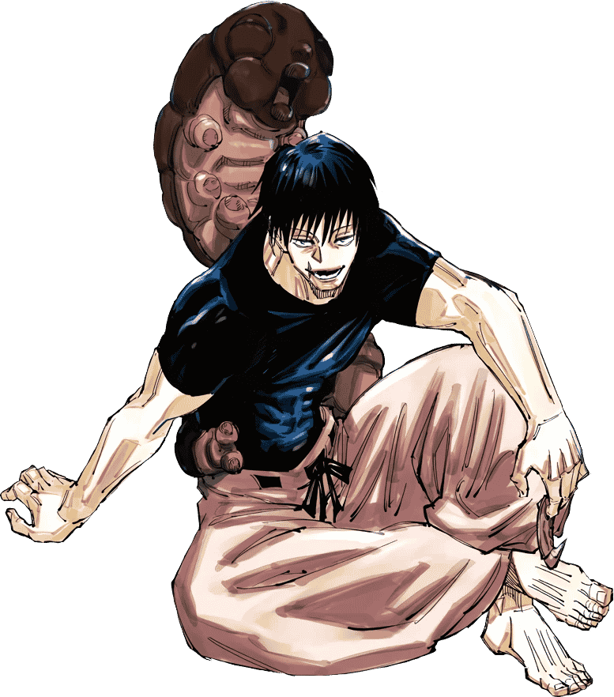

# 🗡 Toji Fushiguro

<mark style="color:orange;">Toji</mark> est le père de [<mark style="color:green;">Megumi</mark> <mark style="color:green;"></mark><mark style="color:green;">**Fushiguro**</mark>](../exorcistes/megumi-fushiguro.md)<mark style="color:green;">**.**</mark> Il possède donc son pseudo à l'annonce des rôles et perd son effet <mark style="color:red;">Force 1</mark> pendant 10 secondes, qui de base est permanant, si il la frappe.&#x20;

Si il se trouve dans une <mark style="color:purple;">extension de territoire</mark>, il obtient <mark style="color:red;">Force 2</mark>.


A chaque début d'épisode :&#x20;

* Il reçoit <mark style="color:yellow;">une cible</mark> lorsqu'il reçoit sa cible il reçoit aussi <mark style="color:red;">son rôle</mark> (qui peut être n'importe quel exorciste mis à part [<mark style="color:green;">Megumi</mark>](../exorcistes/megumi-fushiguro.md)). Si il parvient à l'<mark style="color:yellow;">éliminer</mark>, il <mark style="color:yellow;">gagne 1 cœur</mark> supplémentaire.&#x20;
* il reçoit aussi un message dans le chat lui permettant d'<mark style="color:yellow;">accéder à tout un arsenal</mark>. Chaque arme ne peut être utilisée qu'une seule fois et dure tout un épisode.


Liste des armes :

<table><thead><tr><th>Arme</th><th>Description</th><th data-hidden></th></tr></thead><tbody><tr><td>Lance Céleste</td><td>Quand il frappe un joueur, il lui <mark style="color:yellow;">retire tous ses effets positifs</mark> à l'exception de régénération et absorption. </td><td></td></tr><tr><td>Chaîne de Mille Lieux</td><td>Il obtient une <mark style="color:yellow;">reach de 4 blocs</mark> si aucun joueur ne le regarde. il pourra <mark style="color:yellow;">dash derrière le joueur</mark> en faisant <mark style="color:red;">clique droit</mark> avec son item</td><td></td></tr><tr><td><strong>P</strong>istolet</td><td>Il s'agit d'un <mark style="color:purple;">arc Power III</mark> qui permet, avec un <mark style="color:red;">clic droit</mark>, de lancer des <mark style="color:yellow;">flèches instantanément.</mark></td><td></td></tr><tr><td>Nuage flottant</td><td>Il obtient une épée <mark style="color:purple;">Sharpness III</mark> qui va <mark style="color:yellow;">propulser le joueur 50 blocs au loin</mark> (cooldown 25 hits)</td><td></td></tr><tr><td>Sabre</td><td>Il obtient une <mark style="color:purple;">épée Sharpness IV.</mark></td><td></td></tr></tbody></table>


Une fois toutes les armes utilisées, il <mark style="color:yellow;">gagne 3 cœurs</mark> supplémentaires.&#x20;


