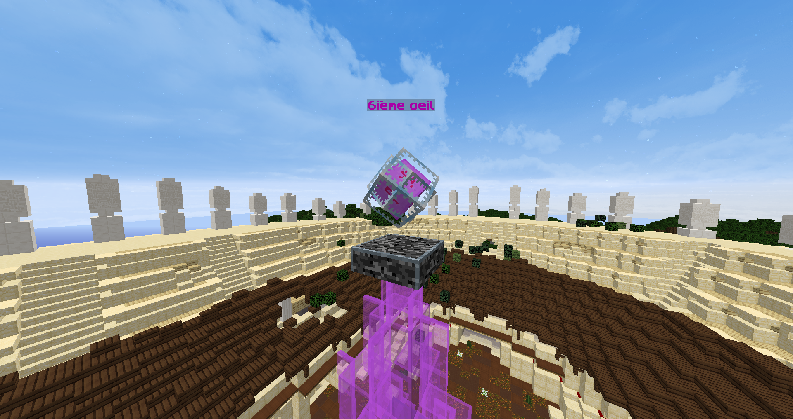

# 🔮 Le Sixième Oeil


A la mort de [<mark style="color:green;">Satoru Gojo</mark>](broken-reference) et après 1 heure 30 minutes, un colisée apparaîtra au centre de la carte.

Après **3minutes 30 secondes** dans le colisée se trouvera un coffre contenant **le sixième œil**.

Le sixième œil est **récupérable**.

Une fois acquis, le joueur le possédant pourra voir la **vie des joueurs** et **leurs énergies occultes**.


